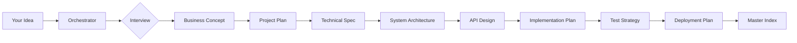

Engineering Docs works through a structured, six-phase pipeline driven by the `using-engineering-docs` orchestrator skill. Understanding how the pipeline operates — particularly the interview mechanism, greenfield versus brownfield detection, and context loading — helps you get the most out of every session and explains why the agent never asks the same question twice. This page covers every phase in detail, including the full skill-sequence flow and output folder structure.

---

## The Six-Phase Pipeline

<Steps>

### Phase 0 — Business Concept Completion (Mode A only)

Before any technical document is drafted, the orchestrator completes an **idea-intake interview** to ensure the business concept itself is fully formed. This phase is mandatory for greenfield projects — every downstream document is built on the answers gathered here.

The interview covers two categories of questions:

**Standing constraint questions** (asked once, early — every downstream skill reads these):
1. Team size and skill level
2. Hosting or infrastructure preference
3. Budget sensitivity
4. Timeline urgency
5. Regulatory and compliance requirements
6. Existing systems to integrate with or avoid

**Business concept questions** (one at a time, multiple choice):
1. What is being built, and what is the single most important thing it must do well?
2. Who are the users, and what problem are they solving today without this product?
3. Why would someone choose this over alternatives, including doing nothing?
4. How does this make money — subscription, one-time, freemium, ads, or internal cost savings?
5. What is the minimum version that is useful? What waits for v2?
6. When does this need to exist, and what is the rough budget?

**Output:** `1-business-plan.md` — the foundational document every later skill reads before asking its own questions.

**Quality gate:** Cannot proceed until the business concept is clear enough that a stranger could understand what is being built, for whom, and why.

---

### Phase 1 — Mode Detection & Project Characterization

Before the interview begins, the orchestrator determines which of two modes to operate in. The required documents, the questions asked, and the skill sequence all depend on this.

<Tabs>
  <Tab title="Mode A — Greenfield">
    **Triggered when:** No `.engineering-docs/` folder exists and the user's request describes a new product from scratch.

    The orchestrator runs the full pipeline, starting from the business concept interview. Every "always core" skill runs. Conditional skills are included or excluded based on what the project actually needs.

    ```text Example prompts that trigger Mode A
    "I want to build a subscription-based habit tracker app."
    "Here's a rough concept for an internal support tool."
    "I want to build a custom gift-box e-commerce site."
    ```
  </Tab>
  <Tab title="Mode B — Brownfield">
    **Triggered when:**
    - A `.engineering-docs/` folder with an `index.md` already exists in the repo, OR
    - The user's request uses language like "add a feature," "extend," "modify," or similar, OR
    - An existing codebase is present with no prior engineering-docs history

    In Mode B the orchestrator does **not** re-run the full business-plan or system-architecture interview. Instead it:
    1. Reads the existing `index.md` and linked documents for context
    2. If no docs exist, scans the codebase or README to infer current architecture, stack, and conventions — then asks the user to confirm or correct that inference
    3. Runs only the subset of skills relevant to the change (typically `technical-blueprint`, `architecture-decision-record`, `api-design-document`, `test-strategy-document`, and others scoped to the feature)
    4. Produces new numbered documents that append to the existing sequence — never overwriting prior history

    ```text Example prompts that trigger Mode B
    "We have an existing app and want to add a payment system."
    "Help me document a new checkout feature for our existing e-commerce platform."
    ```
  </Tab>
</Tabs>

---

### Phase 2 — Sequencing Plan Preview

The orchestrator presents the resulting document list and order — what will be produced, in what order, and a one-line reason for any conditional skill included or excluded. The user can redirect before generation begins ("skip the design system doc — we're API-only") without triggering a multi-question gate.

At this point the orchestrator also **initializes `index.md`** — the master progress ledger that survives context compaction and serves as the anchor for session resumption.

---

### Phase 3 — Sequential Document Generation

Each document is generated in sequence using a strict five-step loop:

1. **Read the skill's `SKILL.md`** — understand what that document needs and how to interview for it
2. **Read all prior documents** in `.engineering-docs/` — extract already-known information (team size, tech stack, constraints, terminology)
3. **Diff** — identify what this document needs that is not already known from prior documents
4. **Ask only the truly missing items** — maximum 2–3 questions per skill; never re-ask anything already in a prior document
5. **Generate the document**, write it to `.engineering-docs/<N>-<slug>.md`, update `index.md`, and confirm with the user before proceeding

Every generated document opens with a metadata frontmatter block:

```yaml Document metadata header
---
title: <document title>
skill: <source skill name>
status: draft | final | superseded
owner_reviewed: true | false
last_updated: <date>
depends_on: [<other doc filenames this one assumes as context>]
supersedes: <filename, if this replaces an earlier doc>
---
```

`owner_reviewed: false` flags any document containing `[agent-decided]` answers from the escape hatch, directing human reviewers to exactly where assumptions were made.

---

### Phase 4 — Consistency & Completeness Pass

After each document is generated (incrementally) and again as a final pass, the orchestrator runs a cross-document consistency check:

- Does the architecture document's chosen approach match what the database and API documents assume?
- Does every endpoint in the API document have a corresponding entity in the database document, or a documented external dependency?
- Does the security threat model cover every external-facing API surface listed in the API document?
- Does the test strategy reference every feature blueprint that exists?
- Do entity names, role names, and terminology match across all documents?

Where a mismatch is found, the orchestrator surfaces the conflict in plain language with a recommended resolution — same as any other question. It never silently picks one.

<Warning>
Consistency checks run **incrementally after each document**, not only at the end. Naming mismatches compound across documents when caught late — an entity called `User` in the spec and `Account` in the database design will create confusion in every downstream document unless reconciled immediately.
</Warning>

---

### Phase 5 — Master Project Index

The final output is the `index.md` master index — the single document that lists every document produced, its status, and the recommended reading order for anyone (or any agent) picking up the project cold.

The index also contains:
- Which phases are complete and which are in progress
- All `[agent-decided]` items that need human review
- A "if you only read three documents" pointer for fast onboarding
- Progress tracking that allows session resumption without re-asking any question

</Steps>

---

## The Interview Mechanism

The tool-call interview is the core of Engineering Docs' quality. Every skill asks its questions via **tool calls**, not inline conversation text. This is a deliberate architectural choice.

<Tabs>
  <Tab title="How it works">
    Each question is presented through a tool call (e.g., `AskUserQuestion`) with:
    - A clear, specific question
    - Multiple-choice answer options
    - A pre-selected recommended answer
    - **"I don't know, you decide"** as an explicit escape hatch on every question

    The agent waits for the user's selection before proceeding to the next question. One question per tool call — batching multiple questions in one message produces partial or shallow answers.
  </Tab>
  <Tab title="Why tool calls, not inline chat">
    Inline questions pollute the conversation context — the agent must later search back through the chat history to find the answers, and they mix with other context in ways that degrade accuracy. Tool-call answers are structured, addressable, and clean.

    This is why the SKILL.md for every skill explicitly prohibits inline questions. The interview IS the value — without it, the agent is guessing.
  </Tab>
  <Tab title="The escape hatch">
    Every question accepts "I don't know, you decide" as a valid answer. When the user takes this path:
    1. The orchestrator picks the most reasonable option given everything gathered so far
    2. Records the choice AND the reasoning in the document, tagged as `[agent-decided]`
    3. Continues without blocking

    Documents with `[agent-decided]` answers set `owner_reviewed: false` in their metadata, flagging them for human review before build starts.
  </Tab>
</Tabs>

---

## Context Loading — No Repeated Questions

Each skill, before asking any interview questions, reads **all prior documents** in `.engineering-docs/` to extract already-known information. This is what prevents the agent from asking "what's your tech stack?" for the seventh time.

The context passing rules are strict:

| Document | Information it carries forward |
|:---|:---|
| `1-business-plan.md` | Problem, users, value proposition, monetization, scope, timeline, budget, constraints |
| `2-project-plan.md` | Milestones, RACI, dependencies |
| `3-user-personas.md` | Target users, jobs-to-be-done, success metrics |
| All prior documents | Entity names, role names, tech stack decisions, terminology |

Every subsequent skill **must** read these before asking questions and **must never** ask a question that is already answered in a prior document.

---

## The Skill Sequence



The full skill directory, showing which documents are always generated versus conditional:

| Phase | Skill | Always or Conditional? |
|:---|:---|:---|
| 0 | `business-concept` | Always |
| 0.5 | `project-plan` | Always |
| 0.6 | `user-personas-behavior` | Always |
| 1 | `technical-feasibility-study` | Conditional — only if a specific approach is technically uncertain |
| 2 | `technical-specification` | Always |
| 2.5 | `ux-flow-specification` | Conditional — skip for pure backend/API-only projects |
| 3 | `system-architecture-document` | Always |
| 3+ | `architecture-decision-record` | Ad hoc — created when a significant decision is made |
| 4 | `database-design-document` | Conditional — skip only if no structured data is persisted |
| 5 | `api-design-document` | Conditional — include if any API surface exists |
| 5.5 | `admin-access-control-specification` | Conditional — include when more than one privilege level exists |
| 6 | `security-threat-model` | Conditional — include when accounts, payments, or PII are involved |
| 7 | `design-system-specification` | Conditional — skip for API-only or CLI projects |
| 8 | `technical-blueprint` | Ad hoc — one per non-trivial feature |
| 8.5 | `implementation-plan` | Always |
| 9 | `test-strategy-document` | Always |
| 10 | `deployment-plan` | Always |
| 11 | `technical-runbook` | Conditional — include once something runs in production |
| 11.5 | `disaster-recovery-plan` | Conditional — include when downtime has real business cost |
| 11.6 | `slo-error-budget-document` | Conditional — include when real users depend on uptime |
| Ongoing | `incident-postmortem` | Reactive only — never scheduled upfront |

<Note>
**Right-sizing, not maximalism.** A weekend side project and a payments platform do not need the same 15 documents. The orchestrator determines which conditional skills apply based on the idea intake interview — generating every possible document regardless of project size defeats the purpose.
</Note>

---

## Session Persistence & Resumption

Full Mode A pipelines can span multiple sessions. The orchestrator is designed to stop and resume without restarting any phase:

- After every phase, `index.md` records which phases are done, which is in progress, and what the next unanswered question is
- On a new invocation of `using-engineering-docs` in a project that already has a partial `.engineering-docs/` folder, the orchestrator reads `index.md` first and resumes exactly where it left off
- Nothing already answered is re-asked

For large projects (10+ documents), the orchestrator suggests starting a fresh session after 5–7 documents, when context accumulation begins to affect output quality. The `index.md` anchor makes resumption seamless — a fresh session reads `index.md`, loads the most recent 2–3 documents for context, and continues from the next pending skill.

---

## Output Folder Structure

```text .engineering-docs/ layout
<project root>/
└── .engineering-docs/
    ├── index.md                          ← Master index: reading order + status
    ├── 1-business-plan.md
    ├── 2-project-plan.md
    ├── 3-user-personas.md
    ├── 4-feasibility-study.md
    ├── 5-technical-specification.md
    ├── 6-ux-flow-specification.md
    ├── 7-system-architecture.md
    ├── 8-database-design.md
    ├── 9-api-design.md
    ├── 10-admin-access-control.md
    ├── 11-security-threat-model.md
    ├── 12-design-system.md
    ├── 13-blueprint-<feature-name>.md    ← One per non-trivial feature
    ├── 14-implementation-plan.md
    ├── 15-test-strategy.md
    ├── 16-deployment-plan.md
    ├── 17-technical-runbook.md
    ├── 18-disaster-recovery.md
    ├── 19-slo-error-budget.md
    └── adr/
        └── 0001-<decision-slug>.md       ← ADRs accumulate over the project's life
```

### Versioning on re-run

When the orchestrator is invoked again on an existing project (Mode B, or a Mode A project revisited), it **never overwrites** an existing numbered file. New or revised content either:

- Appends a new numbered file continuing the existing sequence (e.g., `20-blueprint-checkout-v2.md`), or
- If truly replacing a stale document, moves the old one to `.engineering-docs/archive/` with a timestamp suffix, and the new version takes the next available number

`index.md` always reflects current reality. Nothing is silently lost.

---

## Frequently Asked Questions

<AccordionGroup>
  <Accordion title="Can I use a single skill without running the full pipeline?">
    Yes. Every skill is independently callable. Invoke a skill by name and describe what you need — it runs its own interview (scoped to what it needs) and generates that one document. Standalone mode reads any existing documents in `.engineering-docs/` for context but skips the orchestrator's sequencing and consistency logic.
  </Accordion>
  <Accordion title="What happens if I want to skip a document the orchestrator planned?">
    Tell the orchestrator you want to skip it. The orchestrator confirms the skip, explains any downstream documents that may be affected, marks the document as `status: skipped` in `index.md` with your stated reason, and continues. Any downstream document that depended on the skipped one notes that assumptions were made without it.
  </Accordion>
  <Accordion title="Can documents be revised after they're marked final?">
    Yes. Request a revision and the orchestrator creates a new version (never overwriting) per the versioning rules, re-runs the consistency check against all downstream documents, and flags any downstream documents that may need updates due to the change.
  </Accordion>
  <Accordion title="How does the orchestrator handle very large projects?">
    For projects requiring 10+ documents, the orchestrator can delegate document generation to subagents to preserve its context for coordination. Documents that don't depend on each other — such as `database-design-document` and `api-design-document` (both depend on the architecture but not on each other) — can be generated in parallel. The `index.md` anchor makes this coordination reliable across sessions.
  </Accordion>
  <Accordion title="Are secrets or credentials ever written to generated documents?">
    Never. The security policy is absolute: no API keys, credentials, or connection strings appear in any generated document, even if the user provides them during an interview. References to such values use name/purpose only (e.g., `STRIPE_SECRET_KEY`, to be set via environment variable).
  </Accordion>
  <Accordion title="Does the orchestrator work the same across all 14 agent platforms?">
    Yes. All 22 skills are pure Markdown plus plain instructions — no logic tied to a specific agent harness's proprietary tool names. Any harness-specific action (write a file, ask a question) is described in terms every supported platform can execute. The same skill files work on Claude Code, Gemini CLI, Cursor, Cline, and all other supported platforms.
  </Accordion>
</AccordionGroup>

---

## Next Steps

<CardGroup cols={2}>
  <Card title="Quickstart" icon="bolt" href="/quickstart">
    Install the plugin and run your first skill in under two minutes.
  </Card>
  <Card title="Introduction" icon="book" href="/introduction">
    See the full skills library, custom agents, and platform compatibility table.
  </Card>
</CardGroup>
