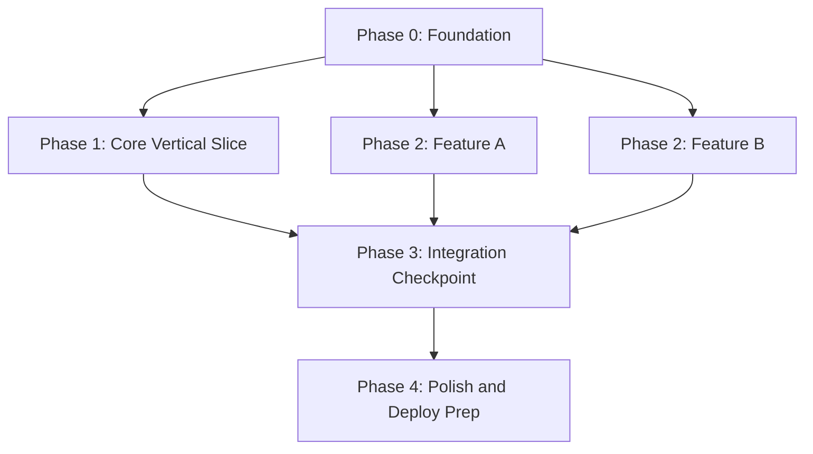

The `implementation-plan` skill produces the document that sits between your architecture and your first commit: the ordered build sequence. It takes your existing system architecture, technical specification, and project plan and sequences them into dependency-driven phases, each with an explicit Definition of Ready, Definition of Done, and a concrete verification step that proves the phase is complete rather than merely written. This is an always-core skill because most implementation failures are ordering failures — building UI before the API contract is stable, building features before the auth foundation exists, integrating a payment provider before the data model that records its results is finalised. The output is precise enough for a human team or an AI coding agent to execute phase by phase without stopping to ask what comes next.

<Info>
  **Type:** Workflow &nbsp;·&nbsp; **Estimated time:** 2–4 hours &nbsp;·&nbsp; **Methodology:** Dependency-driven phasing, vertical slices, three-point estimation &nbsp;·&nbsp; **Output file:** `14-implementation-plan.md` &nbsp;·&nbsp; **Inclusion:** Always-core — every project
</Info>

## Best for

<CardGroup cols={2}>
  <Card title="Sequencing a new project build" icon="list-ol">
    Turn architecture and requirements into an ordered build roadmap once the design phase is complete.
  </Card>
  <Card title="AI coding agent handoff" icon="robot">
    Produce a self-contained plan an AI agent can execute phase by phase without implicit context or ambiguous entry points.
  </Card>
  <Card title="Foundation vs. feature sequencing" icon="layer-group">
    Make explicit which foundational work — auth, data model, CI/CD — must exist before any feature work starts.
  </Card>
  <Card title="Phase gate definition" icon="gate">
    Define binary done criteria so partially-built features cannot be integrated prematurely.
  </Card>
</CardGroup>

## What it produces

The skill outputs `14-implementation-plan.md`, the final planning artefact before implementation begins:

- **Foundation layer table** — components that must exist before feature work (data model, auth, CI/CD) and the specific reason each is foundational
- **Resource allocation matrix** — skills, team members, phases they're involved in, availability percentage, and bottleneck risks
- **Phased build sequence** — one phase block per phase, each containing: what gets built, estimated duration, dependencies, Definition of Ready, Definition of Done, verification steps, code review approach, and rollback procedure
- **Dependency map and graph** — Mermaid DAG showing every dependency edge and which workstreams can run in parallel
- **Integration checkpoints** — explicit points where parallel workstreams must converge and be tested together before proceeding
- **High-uncertainty items and fallbacks** — primary approach and fallback for every item with low-confidence estimates
- **Technical debt register** — every shortcut taken during the build, with owner and target resolution date
- **Completion criteria** — the observable, testable conditions that mean the full implementation is done and ready for the deployment-plan skill
- **Post-implementation handoff** — codebase, documentation, runbook, known issues, and credentials handoff table

## How to invoke it

<CodeGroup>
```bash Claude Code
claude "implementation-plan [project or system name]"

# Examples:
claude "implementation-plan our SaaS app — we have the architecture and specs, sequence the build"
claude "implementation-plan auth system, admin panel, and public API — what order?"
claude "implementation-plan phased roadmap for an AI coding agent to follow end-to-end"
```

```bash Gemini CLI
gemini "implementation-plan [project or system name]"

# Examples:
gemini "implementation-plan our SaaS app — architecture and specs exist, sequence the build"
gemini "implementation-plan auth system, admin panel, and public API — what order?"
```

```bash Generic (any agent)
npx engineering-docs implementation-plan "[project or system name]"
```
</CodeGroup>

<Tip>
  Reference existing documents in your invocation: `implementation-plan marketplace platform — architecture doc exists (Next.js / Node / Postgres / Stripe Connect) and the technical spec is complete`. The skill reads those documents before asking any questions, which reduces the interview to at most 2–3 targeted clarifications.
</Tip>

## Example scenarios

| Invocation | What gets sequenced |
|:---|:---|
| `implementation-plan SaaS app — architecture and specs exist` | Foundation (schema + auth + CI/CD) → Core API slice → Feature phases → Integration checkpoint → Polish/deploy |
| `implementation-plan auth system, admin panel, and public API order` | Auth first (all features depend on it), admin panel second (read-only dependency on auth), public API third (depends on validated auth + data model) |
| `implementation-plan phased roadmap an AI agent could follow end-to-end` | Each phase written as a self-contained unit: what exists, what to build, what "done" means, what to verify before moving on |

## Key concepts

### Foundation before features

Certain components block almost everything else and must be built first — regardless of what feels most important to stakeholders. The skill identifies these explicitly in a Foundation Layer table:

- **Data model / core schema** — nearly everything reads or writes through it; build it first so every subsequent layer has a stable base
- **Authentication and authorisation** — most features require a user context; building features before auth means retroactively adding auth to every endpoint
- **CI/CD and environment setup** — nothing can be verified or deployed without it; a green CI pipeline on day one saves days of integration pain later
- **Core API scaffolding** — shared error handling, middleware, request/response conventions that every feature endpoint inherits

<Warning>
  Sequencing feature work before the foundation layer is the most common cause of implementation rework. The skill will always place foundation components in Phase 0, regardless of stakeholder pressure to start with a visible feature.
</Warning>

### Dependency-driven phases, not calendar phases

A phase boundary must represent a real technical dependency — "Phase 2 cannot start until the data model in Phase 1 is migrated and integration-tested" — not an arbitrary time slice. If two workstreams have no technical dependency on each other, they belong in the **same phase** for parallel execution.

The skill produces a Mermaid dependency graph alongside the phase descriptions so the ordering rationale is always visible:



### Definition of Ready and Definition of Done

Every phase has two explicit criteria:

- **Definition of Ready** — what must be true **before** work on this phase can begin (e.g., "API contract for Phase 2 is frozen, reviewed, and documented")
- **Definition of Done** — what must be true **before** moving to the next phase (e.g., "all Phase 1 endpoints pass integration tests against a seeded database")

Vague phase boundaries — "mostly done," "code is written" — are the most common cause of premature integration and cascading bugs. The skill enforces that every DoD criterion is binary and verifiable.

### Vertical slices over horizontal layers

The skill prefers implementing a thin, fully-working slice through all system layers — one complete user flow: UI → API → DB → response — over building an entire layer (all of the database, then all of the API, then all of the UI) before anything is testable end-to-end. Vertical slices surface integration problems early, when they're cheap to fix.

### Effort estimation methodology

For each phase the skill applies one of three estimation approaches, tagged with a confidence level:

| Method | When to use | Output |
|:---|:---|:---|
| **Analogous estimation** | Similar components exist in prior projects | Person-days with ± adjustment |
| **Three-point (PERT)** | Uncertainty is high: Expected = (O + 4M + P) / 6 | Expected duration + uncertainty range |
| **T-shirt sizing** | Early planning before architecture is stable | S / M / L / XL, converted to person-days later |

Every estimate is tagged with a confidence level (High / Medium / Low). Low-confidence items require a spike or PoC before the phase starts.

### Designed for agent execution

Because an AI coding agent may execute the plan directly, each phase is written as a self-contained unit with no implicit context:

1. What already exists at the start of this phase
2. What to build — specific components, not vague goals
3. What "done" looks like — binary, verifiable, not subjective
4. What to verify before reporting the phase complete

### Technical debt tracking

The plan includes a running debt register. Every shortcut is tracked with:
- **What** — the shortcut taken
- **Why** — the pressure that forced it
- **Owner** — who is responsible for resolving it
- **Target resolution** — the phase by which it must be addressed
- **Cost of leaving unresolved** — what breaks if the debt is never paid

A debt that is not documented does not exist as far as future engineers are concerned — until it surfaces as a production incident.

## Interview process

The skill reads all prior `.engineering-docs/` documents to pre-load known context (tech stack, scope, timeline, team). It then asks a maximum of **2–3 targeted questions** via tool calls, not inline chat:

| Phase | Duration | What happens |
|:---|:---|:---|
| **Phase 1** | Pre-start | Reads business plan, technical spec, architecture, DB design, API design, and technical blueprint for existing context |
| **Interview** | Interactive | Two targeted questions: current state (greenfield vs. existing code) and execution context (human team, AI agent, or both) |
| **Phase 2** | 40–60 min | Foundation identification — what must exist before any feature work |
| **Phase 3** | 60–90 min | Dependency mapping — every major component mapped against what it depends on |
| **Phase 4** | 1.5–2 hrs | Phase definition — DoR, DoD, and verification for each phase |
| **Phase 5** | 40–60 min | Integration checkpoint definition — where parallel workstreams converge |
| **Phase 6** | 30–45 min | Risk and fallback notes for high-uncertainty items |
| **Phase 7** | After review | Cascades feedback through dependency ordering, DoD criteria, and integration checkpoints; re-checks consistency |

## Output structure

<Accordion title="Full document section map">

| # | Section | Contents |
|:---|:---|:---|
| 1 | Overview | Purpose; starting state (greenfield or existing); execution context (human / agent / both) |
| 2 | Foundation Layer | Table of components that block all feature work, with justification per component and owner |
| 3 | Resource Allocation | Skill × team member × phases × availability % × bottleneck risk; contingency buffer |
| 4 | Phased Build Sequence | One block per phase: Builds / Duration / Depends on / Definition of Ready / Definition of Done / Verification / Code Review / Rollback |
| 5 | Dependency Map | Component dependency table; Mermaid DAG showing all dependency edges and parallel opportunities |
| 6 | Integration Checkpoints | Table of convergence points: which workstreams, what verification |
| 7 | High-Uncertainty Items and Fallbacks | Item × uncertainty × primary approach × fallback if primary fails |
| 8 | Technical Debt Register | # × what × why × owner × target resolution × cost of leaving unresolved |
| 9 | Completion Criteria | Observable, testable conditions that mean the full implementation is ready for deployment |
| 10 | Post-Implementation Handoff | Codebase, documentation, runbook, known issues, credentials — each with recipient, artefact, and notes |

</Accordion>

### Phase block format

Every phase in Section 4 uses this consistent template:

```markdown
### Phase N: [Name]

**Builds:** [Specific components — prefer one complete vertical slice]
**Estimated Duration:** [Range with confidence level]
**Depends on:** [Phase(s) — or "Nothing" for Phase 0]
**Definition of Ready:** [What must be true to start]
**Definition of Done:** [Specific, binary, verifiable condition]
**Verification:** [The exact test or check that proves Done]
**Code Review:** [Number of reviewers; any security-aware review requirement]
**Rollback:** [Steps to undo this phase; data loss risk]
```

## Handoff

**Reads from:**

| Document | What it consumes |
|:---|:---|
| `1-business-plan.md` | Project scope, timeline, and business priorities |
| `4-technical-specification.md` | Functional requirements to sequence |
| `7-system-architecture.md` | Technology decisions and infrastructure constraints |
| `8-database-design-document.md` | Core schema, which belongs in Phase 0 |
| `9-api-design-document.md` | API contracts to sequence across phases |
| `14-technical-blueprint.md` | Feature designs to place into build phases |

**Feeds into:**

| Document | What it provides |
|:---|:---|
| Execution | This is the final planning artefact before implementation begins — hand Phase 0 to the engineering team or AI agent |
| `adr/` | Build-order decisions that warrant permanent architecture decision records |

## Quality gate

Before marking the document `final`, the agent verifies five gates:

<Steps>
  <Step title="Every phase has DoR, DoD, and a concrete verification step">
    Not just a deliverables list. The verification step must be something an engineer or agent can execute and get a binary pass/fail result from.
  </Step>
  <Step title="Build order is driven by technical dependency">
    The sequencing rationale is always "B depends on A", never "A looks more exciting" or "stakeholders want A first". The dependency graph makes this explicit and auditable.
  </Step>
  <Step title="Foundation layer is Phase 0 and blocks all feature phases">
    Data model, auth, and CI/CD are always Phase 0. No feature phase has a "Depends on" that precedes them.
  </Step>
  <Step title="Independent workstreams are grouped for parallel execution">
    Two workstreams with no dependency on each other belong in the same phase. Splitting independent work into sequential phases adds schedule risk without reducing technical risk.
  </Step>
  <Step title="Integration checkpoints exist wherever parallel workstreams converge">
    Every place in the dependency graph where two or more parallel streams must merge has a named integration checkpoint with a verification step.
  </Step>
</Steps>
